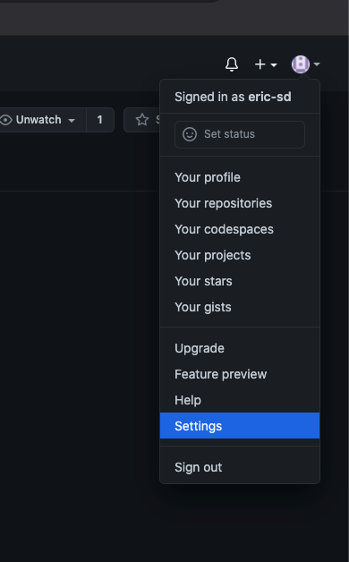
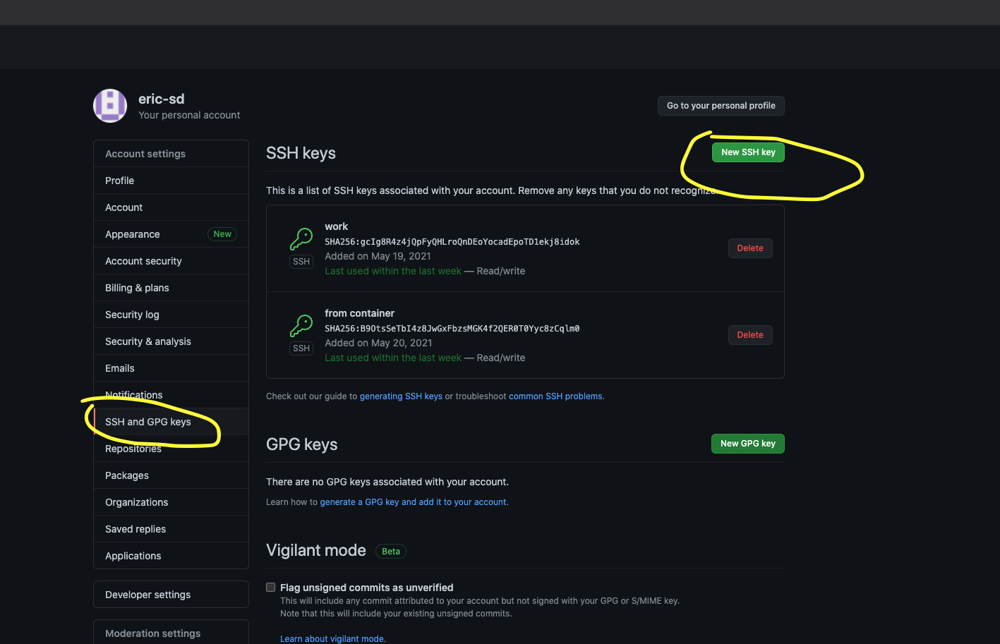
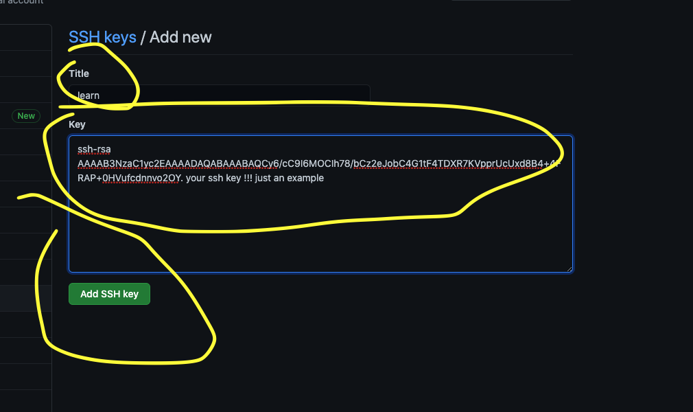

# Lesson 2

# 
1) Build a new image. Copy and paste the docker file!
Lesson 2 (https://github.com/eric-sd/cloudtrainer/tree/main/lesson_2)
```
docker build -t cloudtrain:lesson_2 . 


```

2) Go to  the repo and fork it https://github.com/eric-sd/cloudtrainer
fork(fork.png)

3) Get your ssh key from the container  
```
docker run --rm cloudtrain:lesson_2 cat /home/app/.ssh/id_rsa.pub
```

4) Add your ssh key to your github account





